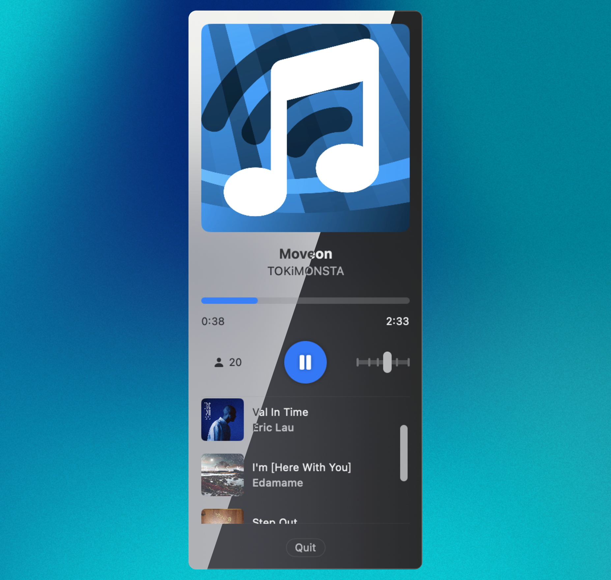

# CodeRadio

🎵 24/7 music designed for coding, now in your mac!

A menu bar music radio client for https://coderadio.freecodecamp.org ([about](https://www.freecodecamp.org/news/code-radio-24-7/)), written in Swift.

## Install

- Download prebuilt binary from [GitHub release page](https://github.com/XiCheng148/CodeRadio/releases).
- enjoy~

## License

This project is licensed under the MIT License. See [LICENSE](LICENSE) file for details.

